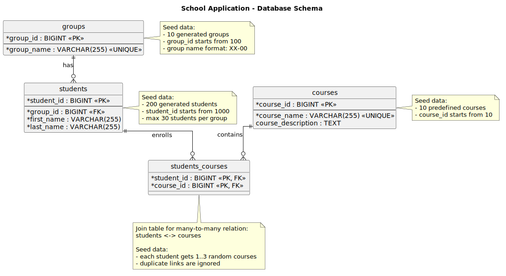
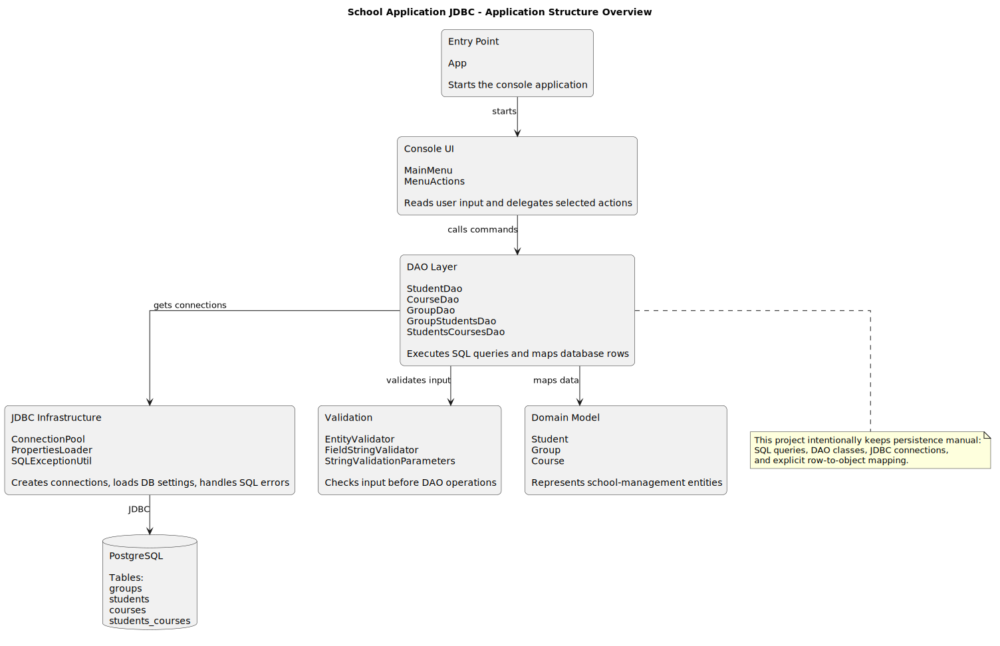

# School Application JDBC

### Java 17 · Plain JDBC · Manual Persistence Baseline

[](https://github.com/Yurii-Kor/school-application-jdbc/actions/workflows/jdbc-ci.yml)


Console-based school management application built with plain Java, JDBC, PostgreSQL, SQL migrations, DAO classes, and manual application wiring.

This repository intentionally keeps the infrastructure simple. It does not include Docker-based deployment because its main purpose is to demonstrate the manual persistence baseline before moving to Spring-based infrastructure in the next projects of the series.

---

## Part of the School Application Series

This project is part of a learning series that implements the same school-management domain through progressively higher persistence abstractions:

1. [School Application JDBC](https://github.com/Yurii-Kor/school-application-jdbc) — plain JDBC, SQL, DAO pattern, manual wiring.
2. [School Application on Spring](https://github.com/Yurii-Kor/school-application-on-spring) — Spring Boot with JDBC infrastructure.
3. [School Application Hibernate](https://github.com/Yurii-Kor/school-application-hibernate) — Hibernate / JPA persistence layer.
4. [School Application Spring Data JPA](https://github.com/Yurii-Kor/school-application-spring-data-jpa) — Spring Data JPA repositories.

The goal of the series is to show how the data access layer evolves from manual SQL and JDBC code to repository-based persistence.

---

## What This Project Demonstrates

* Plain Java console application structure.
* Manual JDBC-based database access.
* DAO pattern for persistence operations.
* PostgreSQL schema managed through SQL migrations.
* Many-to-many relationship between students and courses.
* Manual application wiring without Spring dependency injection.
* Automated tests for persistence and application logic.
* GitHub Actions CI for test and build validation.

---

## Technology Stack

| Area                | Technology                       |
| ------------------- | -------------------------------- |
| Language            | Java 17                          |
| Build tool          | Maven                            |
| Database            | PostgreSQL                       |
| Persistence         | JDBC                             |
| Connection pooling  | HikariCP                         |
| Database migrations | Flyway                           |
| Testing             | JUnit 5, Mockito, Testcontainers |
| CI                  | GitHub Actions                   |

---

## Database Schema

The application uses a simple school-management database schema with academic groups, students, courses, and a many-to-many relation between students and courses.



| Table              | Purpose                                  | Seed data                                  |
| ------------------ | ---------------------------------------- | ------------------------------------------ |
| `groups`           | Stores academic groups                   | 10 random groups, IDs start from `100`     |
| `students`         | Stores students assigned to groups       | 200 random students, IDs start from `1000` |
| `courses`          | Stores available courses                 | 10 predefined courses, IDs start from `10` |
| `students_courses` | Join table for student-course enrollment | Each student gets 1–3 random courses       |

The PlantUML source for this diagram is stored in:

```text
docs/diagrams/database-schema.puml
```

The rendered SVG diagram is stored in:

```text
docs/diagrams/database-schema.svg
```

---

## Application Structure

The application is organized as a small layered console project. The console UI handles user interaction, DAO classes perform manual JDBC operations, and domain classes represent the main school-management entities.



| Layer               | Main classes                                                                    | Responsibility                                                             |
| ------------------- | ------------------------------------------------------------------------------- | -------------------------------------------------------------------------- |
| Entry point         | `App`                                                                           | Starts the console application                                             |
| Console UI          | `MainMenu`, `MenuActions`                                                       | Reads user input and delegates selected actions                            |
| DAO layer           | `StudentDao`, `CourseDao`, `GroupDao`, `GroupStudentsDao`, `StudentsCoursesDao` | Executes SQL queries and maps database rows                                |
| JDBC infrastructure | `ConnectionPool`, `PropertiesLoader`, `SQLExceptionUtil`                        | Provides database connections, loads configuration, and handles SQL errors |
| Domain model        | `Student`, `Group`, `Course`                                                    | Represents the main school-management entities                             |
| Validation          | `EntityValidator`, `FieldStringValidator`, `StringValidationParameters`         | Checks input before DAO operations                                         |

This diagram intentionally hides method-level details and focuses on the manual persistence flow:

```text
App → Console UI → DAO Layer → JDBC Infrastructure → PostgreSQL
```

The PlantUML source for this diagram is stored in:

```text
docs/diagrams/class-overview.puml
```

The rendered SVG diagram is stored in:

```text
docs/diagrams/class-overview.svg
```

---

## Build and Test

Run the test suite:

```bash
./mvnw clean test
```

Build the executable JAR:

```bash
./mvnw clean package
```

Run the application:

```bash
java -jar target/SchoolApplication-0.0.1-SNAPSHOT.jar
```

The application expects PostgreSQL to be available according to the local database configuration.

---

## Project Scope

This repository is intentionally focused on the lowest-level persistence approach in the series:

* no Spring Boot application context;
* no ORM;
* no Spring Data repositories;
* no Docker-based runtime setup.

Those features are introduced step by step in the next repositories of the series.
